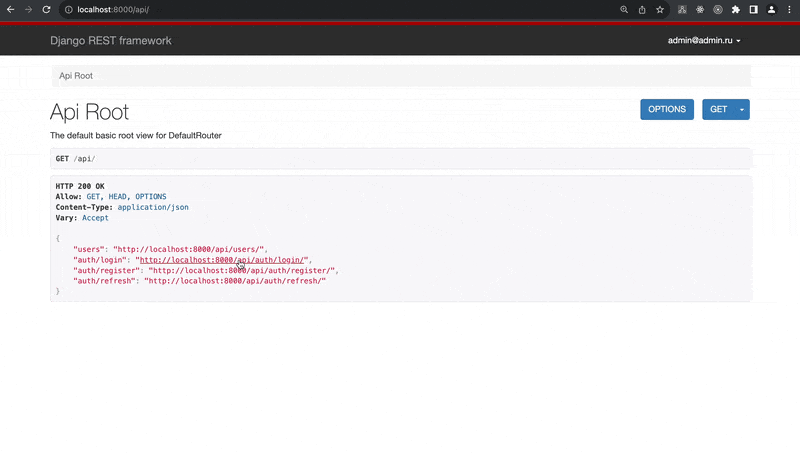

# Demo: DRF / JWT tokens

This is a simple example of implementing JWT tokens for user authorization.

The peculiarity of this implementation is additionally included data about the user in CLAIMS token, as well as additional data that are added to the token when the server responds (transmitted together with the token and do not require decoding).



## 🚀 Quick start

clone this project to your machine and run it with the following command

```bash
docker-compose up
```

## 🔎 Some details

#### ➕ Additional CLAIMS to the token are added in `MyTokenObtainPairSerializer` serializer

```python
class MyTokenObtainPairSerializer(TokenObtainPairSerializer):
    """
    Add additional data to custom claims
    (https://django-rest-framework-simplejwt.readthedocs.io/en/latest/customizing_token_claims.html)
    """

    @classmethod
    def get_token(cls, user):
        token = super().get_token(user)

        token["username"] = user.username  # add this data

        return token
```

and in settings:

```python
#
# SET UP THE CUSTOM CLAIMS FOR TOKEN
SIMPLE_JWT = {
    "TOKEN_OBTAIN_SERIALIZER": "authentication.serializers.MyTokenObtainPairSerializer",
}

```

#### ➕ Additional data (with token) to response are added in `LoginSerializer` serializer

```python
class LoginSerializer(MyTokenObtainPairSerializer):
    """
    Add additional data to response (near to token)
    (Also using custom token serializer which add some extra data)
    """

    def validate(self, attrs):
        data = super().validate(attrs)
        refresh = self.get_token(self.user)

        data["user"] = UserSerializer(self.user).data  # add this data
        data["refresh"] = str(refresh)
        data["access"] = str(refresh.access_token)

        if api_settings.UPDATE_LAST_LOGIN:
            update_last_login(None, self.user)

        return data
```

P.S. Don't forget to add custom user in settings

```python
AUTH_USER_MODEL = "authentication.User"
```
